# Diagrama de Base de Datos — Proyecto ISO

> Renderizar con cualquier visor Mermaid (VS Code extension, GitHub, mermaid.live)

```mermaid
erDiagram
    %% ═══════════════════════════════════════════
    %% NIVEL BASE
    %% ═══════════════════════════════════════════

    ISOS {
        INT id PK
        VARCHAR nombre
        TEXT descripcion
        DATETIME created_at
    }

    ROLES {
        INT id PK
        VARCHAR nombre
        DATETIME created_at
    }

    ESPACIO_TRABAJO {
        INT id PK
        VARCHAR nombre_cliente
        DATETIME fecha_creacion
    }

    %% ═══════════════════════════════════════════
    %% NIVEL 1
    %% ═══════════════════════════════════════════

    CLAUSULAS {
        INT id PK
        INT iso_id FK
        INT numero_clausula
        VARCHAR titulo
        DATETIME created_at
    }

    USUARIOS {
        INT id PK
        INT workspace_id FK
        INT role_id FK
        VARCHAR nombre
        VARCHAR email UK
        VARCHAR password_hash
        VARCHAR reset_token
        DATETIME expiration_date
        ENUM estado_invitacion "Pendiente|Aceptada|Expirada"
        DATETIME fecha_registro
    }

    %% ═══════════════════════════════════════════
    %% NIVEL 2
    %% ═══════════════════════════════════════════

    REQUISITOS_BASE {
        INT id PK
        INT clausula_id FK
        INT requisito_padre_id FK "Autorreferencia"
        TEXT descripcion_normativa
        DATETIME created_at
    }

    SESIONES_USUARIO {
        INT id PK
        INT usuario_id FK
        VARCHAR ip_conexion
        TEXT user_agent
        DATETIME fecha_inicio
        DATETIME fecha_cierre
        INT duracion_minutos
        ENUM tipo_cierre "Logout|Expirada|Forzada"
        ENUM estado "Activa|Cerrada"
    }

    SESSIONS {
        INT id PK
        INT user_id FK
        VARCHAR token UK
        DATETIME expires_at
        DATETIME created_at
    }

    NOTIFICACIONES {
        INT id PK
        INT usuario_id FK
        VARCHAR tipo
        TEXT mensaje
        VARCHAR link
        TINYINT read_flag
        DATETIME created_at
    }

    %% ═══════════════════════════════════════════
    %% NIVEL 3
    %% ═══════════════════════════════════════════

    ACTIVIDAD_USUARIO {
        INT id PK
        INT usuario_id FK
        INT sesion_id FK
        ENUM tipo_accion "LOGIN|UPDATE|CREATE|DELETE|UPLOAD"
        VARCHAR tabla_afectada
        INT registro_id
        TEXT descripcion
        VARCHAR ip_conexion
        DATETIME fecha_accion
    }

    PROCESOS {
        INT id PK
        INT requisito_base_id FK
        VARCHAR nombre
        TEXT descripcion
        DATETIME fecha_creacion
        INT creado_por
    }

    EVALUACION_REQUISITO {
        INT id PK
        INT requisito_base_id FK
        INT workspace_id FK
        ENUM estado_cumplimiento "Cumple|Parcial|No cumple|NA"
        INT ultima_edicion_por FK
        DATETIME fecha_ultima_edicion
    }

    %% ═══════════════════════════════════════════
    %% NIVEL 4
    %% ═══════════════════════════════════════════

    METODOS_CONTROLES {
        INT id PK
        INT proceso_id FK
        TEXT descripcion_metodo
        TEXT procedimiento_control
        DATETIME fecha_creacion
        INT creado_por
    }

    EVIDENCIAS {
        INT id PK
        INT evaluacion_requisito_id FK
        INT usuario_carga_id FK
        INT ev_id FK "Evaluador que revisa"
        VARCHAR nombre_archivo
        VARCHAR url_archivo
        VARCHAR drive_file_id
        VARCHAR tipo_formato
        ENUM estado_validacion_archivo "Pendiente|Aceptado|Rechazado"
        TEXT comentario_evidencia
        DATETIME fecha_carga
    }

    EVALUACION_REQUISITO_HIST {
        INT id PK
        INT ev_id FK
        ENUM estado_cumplimiento "Cumple|Parcial|No cumple|NA"
        INT ultima_edicion_por FK
        DATETIME fecha_snapshot
        VARCHAR accion
    }

    AUDITORIA_NC {
        INT id PK
        INT evaluacion_requisito_id FK
        INT evaluador_id FK
        INT evaluado_id FK
        VARCHAR estado_flujo "Abierta|Analisis|Ejecucion|Verificacion|Cerrada"
        ENUM estado_validacion "Acepto|Parcial|No Acepto"
        DATE fecha_verificacion_eficacia
        TEXT comentario_nc
        VARCHAR titulo
        TEXT descripcion
        INT ultima_edicion_por FK
        DATETIME fecha_ultima_edicion
    }

    %% ═══════════════════════════════════════════
    %% NIVEL 5
    %% ═══════════════════════════════════════════

    ACCIONES_CORRECTIVAS {
        INT id PK
        INT auditoria_nc_id FK
        INT accion_previa_id FK "Linked-list (hija)"
        INT autor_id FK
        ENUM tipo_autor "Evaluador|Responsable SGC|Sistema"
        TEXT nc
        TEXT accion
        TEXT contenido_comentario
        ENUM estado_accion "Pendiente|En_Progreso|Eficaz|No_Eficaz"
        TEXT acciones_futuras_propuestas
        TINYINT requiere_nueva_nc
        DATETIME fecha_accion
    }

    AUDITORIA_NC_HIST {
        INT id PK
        INT nc_id FK
        VARCHAR estado_flujo
        ENUM estado_validacion "Acepto|Parcial|No Acepto"
        DATE fecha_verificacion_eficacia
        TEXT comentario
        INT evaluador_id FK
        INT evaluado_id FK
        INT ultima_edicion_por FK
        DATETIME fecha_snapshot
    }

    EVIDENCIAS_LOG {
        INT id PK
        INT evidencia_id FK
        INT usuario_id FK
        INT ev_id FK
        ENUM tipo_accion "UPLOAD|DELETE|UPDATE|REPLACE|APPROVAL"
        VARCHAR nombre_archivo
        TEXT detalle
        DATETIME fecha_accion
    }

    SCHEDULED_NOTIFICATIONS {
        INT id PK
        INT nc_id FK
        INT usuario_id FK
        DATETIME trigger_at
        TINYINT sent_flag
        DATETIME created_at
    }

    AUDITORIA_NC_RESPONSABLES {
        INT auditoria_nc_id PK,FK
        INT usuario_id PK,FK
    }

    AUDITORIA_NC_PROCESOS {
        INT auditoria_nc_id PK,FK
        INT proceso_id PK,FK
    }

    CHAT_MESSAGES {
        INT id PK
        INT requisito_id FK
        INT nc_id FK
        INT accion_id FK
        INT evidencia_id FK
        INT autor_id FK
        TEXT contenido
        VARCHAR referencia_type
        INT referencia_id
        JSON metadata
        DATETIME created_at
        DATETIME edited_at
    }

    %% ═══════════════════════════════════════════
    %% NIVEL 6
    %% ═══════════════════════════════════════════

    ACCIONES_CORRECTIVAS_HIST {
        INT id PK
        INT accion_id FK
        VARCHAR estado_anterior
        VARCHAR estado_nuevo
        INT usuario_id FK
        TEXT comentario
        DATETIME fecha_snapshot
    }

    %% ═══════════════════════════════════════════
    %% RELACIONES
    %% ═══════════════════════════════════════════

    %% Nivel Base → Nivel 1
    ISOS ||--o{ CLAUSULAS : "tiene"
    ESPACIO_TRABAJO ||--o{ USUARIOS : "contiene"
    ROLES ||--o{ USUARIOS : "asigna"

    %% Nivel 1 → Nivel 2
    CLAUSULAS ||--o{ REQUISITOS_BASE : "contiene"
    REQUISITOS_BASE ||--o{ REQUISITOS_BASE : "padre-hijo"
    USUARIOS ||--o{ SESIONES_USUARIO : "tiene"
    USUARIOS ||--o{ SESSIONS : "refresh tokens"
    USUARIOS ||--o{ NOTIFICACIONES : "recibe"

    %% Nivel 2 → Nivel 3
    REQUISITOS_BASE ||--o{ PROCESOS : "tiene"
    REQUISITOS_BASE ||--o{ EVALUACION_REQUISITO : "evaluado por"
    ESPACIO_TRABAJO ||--o{ EVALUACION_REQUISITO : "pertenece a"
    USUARIOS ||--o{ ACTIVIDAD_USUARIO : "genera"
    SESIONES_USUARIO ||--o{ ACTIVIDAD_USUARIO : "en sesion"

    %% Nivel 3 → Nivel 4
    EVALUACION_REQUISITO ||--o{ EVIDENCIAS : "tiene"
    EVALUACION_REQUISITO ||--o{ AUDITORIA_NC : "tiene brechas"
    EVALUACION_REQUISITO ||--o{ EVALUACION_REQUISITO_HIST : "historial"
    PROCESOS ||--o{ METODOS_CONTROLES : "tiene"

    %% Nivel 4 → Nivel 5
    AUDITORIA_NC ||--o{ ACCIONES_CORRECTIVAS : "tiene"
    AUDITORIA_NC ||--o{ AUDITORIA_NC_HIST : "historial"
    AUDITORIA_NC ||--o{ SCHEDULED_NOTIFICATIONS : "programa"
    AUDITORIA_NC ||--o{ AUDITORIA_NC_RESPONSABLES : "asigna"
    AUDITORIA_NC ||--o{ AUDITORIA_NC_PROCESOS : "vincula"
    AUDITORIA_NC ||--o{ CHAT_MESSAGES : "discute"
    EVIDENCIAS ||--o{ EVIDENCIAS_LOG : "historial"
    EVIDENCIAS ||--o{ CHAT_MESSAGES : "discute"
    USUARIOS ||--o{ AUDITORIA_NC_RESPONSABLES : "es responsable"
    PROCESOS ||--o{ AUDITORIA_NC_PROCESOS : "vinculado"

    %% Nivel 5 → Nivel 6
    ACCIONES_CORRECTIVAS ||--o{ ACCIONES_CORRECTIVAS : "hija de (linked-list)"
    ACCIONES_CORRECTIVAS ||--o{ ACCIONES_CORRECTIVAS_HIST : "historial"
    ACCIONES_CORRECTIVAS ||--o{ CHAT_MESSAGES : "discute"

    %% Relaciones de usuarios (FKs de auditoría)
    USUARIOS ||--o{ AUDITORIA_NC : "evalua"
    USUARIOS ||--o{ EVIDENCIAS : "sube"
    USUARIOS ||--o{ ACCIONES_CORRECTIVAS : "crea"
    USUARIOS ||--o{ CHAT_MESSAGES : "escribe"
```

## Resumen del Schema

| Nivel | Tablas | Propósito |
|-------|--------|-----------|
| Base | ISOS, ROLES, ESPACIO_TRABAJO | Entidades independientes fundamentales |
| 1 | CLAUSULAS, USUARIOS | Estructura normativa y personas |
| 2 | REQUISITOS_BASE, SESSIONS, SESIONES_USUARIO, NOTIFICACIONES | Árbol ISO, auth, comunicación |
| 3 | EVALUACION_REQUISITO, PROCESOS, ACTIVIDAD_USUARIO | Pivot central, procesos, auditoría técnica |
| 4 | EVIDENCIAS, AUDITORIA_NC, EVALUACION_REQUISITO_HIST, METODOS_CONTROLES | Documentos, brechas, historial evaluación |
| 5 | ACCIONES_CORRECTIVAS, AUDITORIA_NC_HIST, EVIDENCIAS_LOG, SCHEDULED_NOTIFICATIONS, tablas N:M, CHAT_MESSAGES | Acciones, historiales, chat, programación |
| 6 | ACCIONES_CORRECTIVAS_HIST | Historial detallado de acciones |

**Total: 22 tablas**

## Tabla Pivot Central

`EVALUACION_REQUISITO` es el pivote: vincula un requisito ISO con un workspace. Todo lo per-cliente (evidencias, brechas, acciones, chat) cuelga de aquí.
