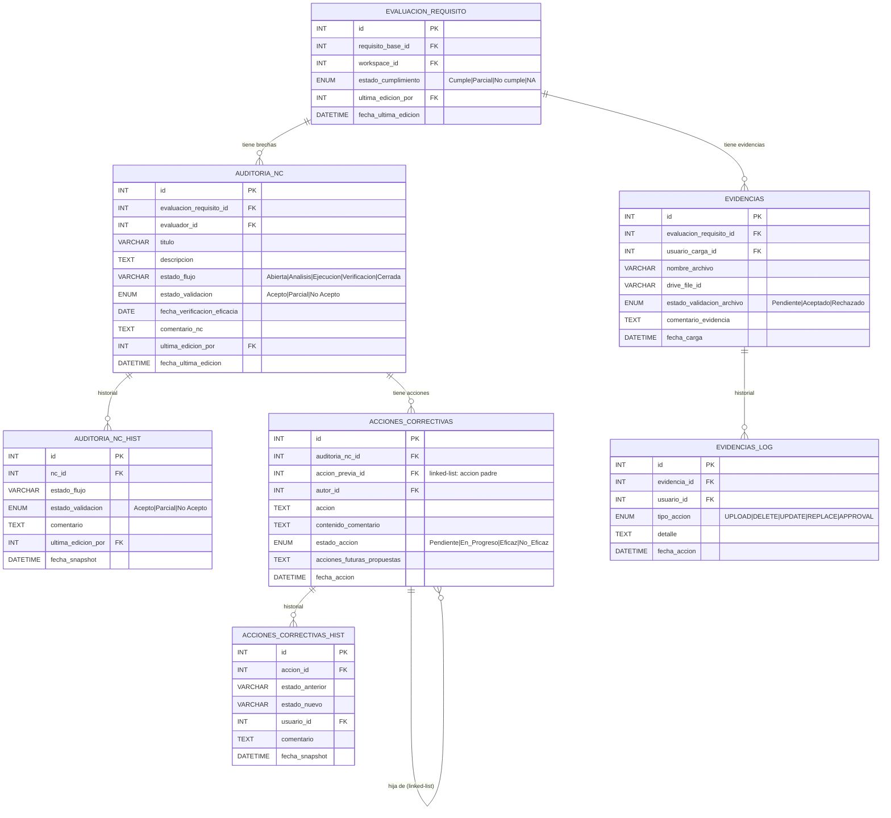

# Diagrama Núcleo — Flujo GAP + Brechas + Acciones + Evidencias

> Las 6 tablas centrales del sistema. Todo lo per-workspace cuelga de `EVALUACION_REQUISITO`.



## Lectura del flujo

```
EVALUACION_REQUISITO  ← pivot central, 1 por requisito por workspace
  │
  ├── AUDITORIA_NC          ← brecha detectada en ese requisito
  │     ├── AUDITORIA_NC_HIST       ← cada cambio de estado queda registrado
  │     └── ACCIONES_CORRECTIVAS   ← acciones para cerrar la brecha
  │           ├── ACCIONES_CORRECTIVAS (hija, linked-list)
  │           └── ACCIONES_CORRECTIVAS_HIST  ← historial campo por campo
  │
  └── EVIDENCIAS            ← documentos que respaldan el requisito
        └── EVIDENCIAS_LOG  ← cada upload, reemplazo o aprobación
```
