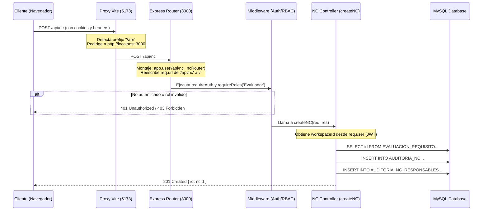

# Auditoría Técnica: Flujo de Comunicación Frontend-Backend

Este documento contiene un análisis detallado y verificado en código de la arquitectura de comunicación entre el frontend (React + Vite) y el backend (Node.js + Express + MySQL + WebSockets) de este proyecto.

---

## 1. Resumen Ejecutivo

La comunicación entre el frontend y el backend de la aplicación se realiza de forma híbrida mediante:
1. **API REST (HTTP/JSON):** Para todas las operaciones CRUD (Creación, Lectura, Actualización, Eliminación) de datos y autenticación.
2. **WebSockets (protocolo `ws`):** Exclusivamente para la mensajería del chat contextual de Requisitos y No Conformidades (NC) en tiempo real.

En desarrollo, todas las peticiones (REST y WebSocket) se consolidan bajo el puerto del servidor de desarrollo de Vite (`5173`) y se redirigen mediante su proxy al backend (`3000`), evitando problemas de CORS en local. La seguridad a nivel de datos se gestiona mediante tokens JWT y se valida rigurosamente a nivel de base de datos e IDOR en los controladores del backend.

---

## 2. Arquitectura de Comunicación Observada

El sistema se compone de tres piezas clave que interactúan entre sí:
1. **Cliente (Navegador):** Ejecuta React y se comunica mediante URLs relativas que apuntan al origen actual (`window.location.origin`).
2. **Proxy de Desarrollo (Vite):** Escucha en `localhost:5173` y reenvía peticiones internas `/api`, `/auth`, `/google-drive` y `/ws` hacia el servidor backend.
3. **Backend API & WebSocket Server (Express):** Escucha en el puerto `3000` (o el contenedor `backend-js`), resuelve el enrutamiento HTTP y gestiona las conexiones persistentes WebSocket.

---

## 3. Flujo REST Completo: Creación de una Brecha (No Conformidad en backend)

Para entender cómo viajan los datos en el sistema, a continuación se describe el ciclo de vida de una petición para crear una No Conformidad (`POST /api/nc`):

### Diagrama de Secuencia (Mermaid)


### Paso a Paso Detallado:
1. **Invocación en React:** El usuario completa el formulario de Brechas en la vista de requisitos. El archivo [RequirementView.jsx (línea 109)](file:///c:/Users/Maxim/Desktop/ProyectoISO/frontend/src/pages/RequirementView.jsx#L109) invoca a la función `fetchWithAuth('/api/nc', { method: 'POST', body: ... })`.
2. **Procesamiento en `api.js`:** La función wrapper `fetchWithAuth` en [api.js (línea 19)](file:///c:/Users/Maxim/Desktop/ProyectoISO/frontend/src/lib/api.js#L19) construye la URL final de la petición.
3. **Resolución de la URL Relativa:** Como `isDev` es `true` y no se proveen variables absolutas, `API_BASE` se define como `''`. El navegador resuelve la ruta como `http://localhost:5173/api/nc`.
4. **Recepción en el Servidor de Desarrollo:** La petición es recibida por el servidor de desarrollo de Vite en el puerto `5173`.
5. **Proxy de Vite:** En [vite.config.js (línea 11)](file:///c:/Users/Maxim/Desktop/ProyectoISO/frontend/vite.config.js#L11), Vite detecta que la petición inicia con el prefijo `/api` y la intercepta.
6. **Redirección al Backend:** Vite reenvía la petición al backend (`http://localhost:3000/api/nc`) usando la directiva `target` (que por defecto en local es `http://localhost:3000`).
7. **Montaje en Express:** En el backend [index.js (línea 47)](file:///c:/Users/Maxim/Desktop/ProyectoISO/backend-js/src/index.js#L47), Express monta el enrutador para las NC mediante:
   ```javascript
   app.use('/api/nc', ncRouter);
   ```
8. **Enrutamiento Interno:** Express elimina internamente el prefijo de montaje:
   - `req.originalUrl` se mantiene como `/api/nc`.
   - `req.baseUrl` se establece en `/api/nc`.
   - `req.url` se reescribe a `/` para que coincida con las rutas internas del router.
9. **Coincidencia en Router:** En [routes/nc.js (línea 8)](file:///c:/Users/Maxim/Desktop/ProyectoISO/backend-js/src/routes/nc.js#L8), Express hace coincidir la petición con:
   ```javascript
   router.post('/', requireAuth, requireRoles('Evaluador'), createNC);
   ```
10. **Ejecución de Middlewares de Seguridad:**
    - `requireAuth` valida la presencia y firma del token JWT en el header `Authorization`.
    - `requireRoles('Evaluador')` comprueba que el rol en el token sea 'Evaluador' o 'Admin'.
11. **Controlador:** Se invoca a `createNC` en [ncController.js (línea 6)](file:///c:/Users/Maxim/Desktop/ProyectoISO/backend-js/src/controllers/ncController.js#L6).
12. **Consulta a Base de Datos:** El controlador resuelve el `workspaceId` desde `req.user.workspace_id` (del token JWT), comprueba la existencia de la evaluación, inserta la NC en `AUDITORIA_NC` y opcionalmente asocia responsables y notificaciones.
13. **Retorno de Respuesta:** El backend responde con un código HTTP `201` y el ID de la NC creada, retornando por el camino inverso hasta el componente React.

---

## 4. Rutas Relativas, Path Parameters y Query Parameters

### Concepto de Rutas Relativas en el Navegador
* Al ejecutar `fetch('/api/nc')` en el frontend, no se provee un protocolo ni dominio.
* El navegador automáticamente le antepone el **origen actual** (`window.location.origin`). Si el frontend está en `http://localhost:5173`, el navegador resolverá y enviará la petición a `http://localhost:5173/api/nc`.
* **fetchWithAuth** no se comunica directamente con el motor de Vite. Simplemente despacha la petición al navegador, y es el servidor de desarrollo de Vite (que está escuchando en el puerto `5173`) el que procesa la llamada entrante.

### Parámetros de URL: "?" y "&"
En HTTP, los parámetros se adjuntan a la URL estructurando el query string:
* Ejemplo: `/api/nc?workspace=3&estado=Abierta`
  * **Pathname:** Lo que precede al signo `?` (`/api/nc`).
  * **Query String:** Lo que sigue al signo `?` (`workspace=3&estado=Abierta`).
  * **Separadores:** El signo `?` inicia la cadena de consulta y `&` separa cada pareja clave-valor.
  * En Express, estos parámetros se leen dinámicamente mediante el objeto `req.query` (ej. `req.query.workspace` y `req.query.estado`).

### Tipos de Parámetros y su Mapeo en Express
* **Path Parameter (Parámetro de Ruta):** Define un recurso específico en la ruta estructurada.
  * Ruta en Express: `/api/nc/:id` $\rightarrow$ Endpoint real: `/api/nc/15` $\rightarrow$ Leído en backend como `req.params.id`.
* **Query Parameter (Parámetro de Consulta):** Filtra o complementa una petición sin alterar la ruta base.
  * Endpoint real: `/api/nc?workspace=3` $\rightarrow$ Leído en backend como `req.query.workspace`.
* **Body (Cuerpo de la Petición):** Envía datos estructurados (típicamente JSON) en peticiones POST, PUT o PATCH.
  * Leído en backend como `req.body`. Requiere el middleware `express.json()`.
* **Header (Cabeceras HTTP):** Metadatos de la petición como autenticación o tipos de contenido.
  * Leído en backend como `req.headers` (ej. `req.headers.authorization`).

---

## 5. Contexto `actingWorkspace` (Workspace Activo)

El flujo verificado en el código para la administración multi-tenant funciona de la siguiente manera:

1. **Selección del Contexto:** Un usuario con rol `Admin` accede a la consola de administración en [WorkspacesManager.jsx](file:///c:/Users/Maxim/Desktop/ProyectoISO/frontend/src/pages/WorkspacesManager.jsx) y presiona "Acceder" en el workspace deseado.
2. **Almacenamiento Local:** El frontend guarda el ID de ese workspace mediante `sessionStorage.setItem('actingWorkspace', id)`.
3. **Interceptación de API:** Al realizar cualquier petición, la función `fetchWithAuth` en [api.js (línea 29)](file:///c:/Users/Maxim/Desktop/ProyectoISO/frontend/src/lib/api.js#L29) ejecuta la subfunción `appendWorkspaceFromLocation`.
4. **Propagación en URL de API:** Si `sessionStorage` tiene un valor para `actingWorkspace`, este se anexa automáticamente como parámetro de consulta a la petición interna de la API (ej. `/api/evidencias/...?workspace=ID`).
5. **Validación en Backend:** 
   * **Usuarios comunes (Evaluador/Responsable):** El backend en sus controladores (ej: [evidenceController.js línea 6](file:///c:/Users/Maxim/Desktop/ProyectoISO/backend-js/src/controllers/evidenceController.js#L6)) prioriza estrictamente el ID del token JWT (`req.user.workspace_id`). Cualquier parámetro `?workspace=` alternativo enviado por el cliente es **ignorado** para mitigar ataques de elevación de privilegios (IDOR).
   * **Administrador:** Al no tener un `workspace_id` fijo en su token, el backend le permite consultar la base de datos utilizando el ID del parámetro enviado en la consulta (`req.query.workspace` o `req.body.workspace_id`).
6. **Limpieza en Logout:** Al cerrar sesión, la función `logout` en [AuthContext.jsx](file:///c:/Users/Maxim/Desktop/ProyectoISO/frontend/src/AuthContext.jsx) limpia el estado local de React, lo que desencadena un efecto secundario que remueve la clave del almacenamiento local mediante `sessionStorage.removeItem('actingWorkspace')`.

---

## 6. Variables de Entorno de Vite

### Variables Integradas (Automáticas)
Vite inyecta por defecto variables sobre el estado de la aplicación:
* `import.meta.env.DEV`: `true` en modo desarrollo.
* `import.meta.env.PROD`: `true` en producción.
* `import.meta.env.MODE`: Modo actual (ej. `'development'`, `'production'`).
* `import.meta.env.BASE_URL`: La URL base del despliegue del frontend.

### Variables Personalizadas (No Automáticas)
Las variables personalizadas en Vite **deben estar prefijadas con `VITE_`** para que puedan ser expuestas en el código del cliente navegador (ej. `import.meta.env.VITE_BACKEND_URL`). 
* Estas variables no se autodefinen; deben declararse en archivos `.env` (o `.env.local`, `.env.production`), proveerse por variables de entorno del sistema o a través del archivo `docker-compose.yml`.

### Diferencia de Contexto de Variables
* `import.meta.env.VITE_BACKEND_URL`: Se evalúa en el **navegador del cliente** (frontend). Es estático y se incrusta en el código compilado durante el build.
* `process.env.VITE_BACKEND_URL`: Se evalúa en **Node.js** (backend/entorno de compilación). Se utiliza en archivos de configuración del lado del servidor como `vite.config.js` durante la ejecución de tareas de desarrollo o compilación.

### Código de Inicialización de `API_BASE`
Se ha verificado que el código actual en [api.js (línea 26)](file:///c:/Users/Maxim/Desktop/ProyectoISO/frontend/src/lib/api.js#L26) utiliza:
```javascript
const API_BASE = isDev ? '' : (envBase || '')
```
* **Efecto de `npm run dev`:** `import.meta.env.DEV` es `true`. `API_BASE` se evalúa como `''`, forzando el uso de rutas relativas y activando el proxy de Vite en desarrollo.
* **Efecto de `vite build`:** `import.meta.env.DEV` es `false`. `API_BASE` toma el valor de `envBase` (de `VITE_API_BASE` o `VITE_BACKEND_URL`). Si ninguna de ellas está definida, toma una cadena vacía `''` (asumiendo despliegue en un mismo origen).

---

## 7. Configuración del Proxy de Vite

El proxy de desarrollo de Vite se configura en [vite.config.js (línea 11)](file:///c:/Users/Maxim/Desktop/ProyectoISO/frontend/vite.config.js#L11).

* **Rutas Interceptadas:** `/api`, `/auth`, `/google-drive`, `/ws`.
* **Destino Configurado:** Redirige a `process.env.VITE_BACKEND_URL` o, en su defecto, a `http://localhost:3000`.
* **Regla de reescritura:**
  ```javascript
  rewrite: (path) => path.replace(/^\/api/, '/api')
  ```
  * **Análisis:** Esta regla reemplaza `/api` por `/api`. Por lo tanto, no modifica la ruta y mantiene el prefijo intacto al transferir la petición al backend.
* **Nota Importante:** El proxy de Vite es una funcionalidad del servidor de desarrollo local y **deja de existir en producción** cuando el frontend se compila a archivos estáticos (HTML/JS/CSS).

---

## 8. Análisis de WebSockets

El proyecto cuenta con soporte de WebSockets real y funcional para la mensajería del chat contextual.

1. **¿El frontend consume endpoints REST?** Sí, casi en su totalidad.
2. **¿Qué módulos realizan las peticiones REST?** El módulo [api.js](file:///c:/Users/Maxim/Desktop/ProyectoISO/frontend/src/lib/api.js) mediante la función `fetchWithAuth`.
3. **¿Existe realmente WebSocket en el frontend?** Sí, en el componente de chat.
4. **¿Dónde se instancia?** En [Chat.jsx (línea 52)](file:///c:/Users/Maxim/Desktop/ProyectoISO/frontend/src/components/Chat.jsx#L52):
   ```javascript
   const ws = new window.WebSocket(wsUrl)
   ```
5. **¿A qué URL y puerto se conecta?** Se conecta al host actual bajo la ruta `/ws`, enviando el token de acceso y el identificador de requisito o no conformidad como parámetros de consulta:
   `ws://localhost:5173/ws?token=JWT&requisito_id=ID` (en desarrollo).
6. **¿Pasa por el proxy de Vite?** Sí. Vite intercepta la ruta `/ws` y, mediante la opción `ws: true` en [vite.config.js (línea 40)](file:///c:/Users/Maxim/Desktop/ProyectoISO/frontend/vite.config.js#L40), realiza el "upgrade" de protocolo HTTP a WS y lo reenvía al backend.
7. **¿Dónde se crea el servidor WebSocket?** En el backend, en [ws.js (línea 16)](file:///c:/Users/Maxim/Desktop/ProyectoISO/backend-js/src/services/ws.js#L16) utilizando la librería `ws`. El archivo principal [index.js (línea 101)](file:///c:/Users/Maxim/Desktop/ProyectoISO/backend-js/src/index.js#L101) lo integra con el servidor HTTP de Node.js interceptando el evento `'upgrade'`.
8. **¿Cómo se autentican las conexiones?** Se leen los parámetros de consulta al establecer la conexión (`query.token`). El backend valida el token con `verifyAccessToken(query.token)`. Sin embargo, si el token falta o expira, el backend no cierra la conexión inmediatamente (permite al cliente mantenerse conectado con `user = null`).
9. **¿Cómo se realiza el broadcast?** El servidor WebSocket organiza las conexiones en "salas" virtuales (`rooms`) basadas en claves como `requisito:ID` o `nc:ID`. Cuando un usuario escribe un mensaje (a través del endpoint HTTP POST `/api/chat`), el controlador invoca a `broadcast('chat:new', msg)`. Este método recorre las conexiones suscritas a esa sala y les envía el mensaje formateado en JSON.
10. **¿Dónde ocurre el filtrado por workspace?** El filtrado de mensajes de chat ocurre a nivel de **requisitos y NC individuales** (salas virtuales en el servidor).
11. **Limitaciones Técnicas del WebSocket:**
    * **Seguridad (IDOR en Conexión):** El handshake y la suscripción a salas de WebSockets no validaban originalmente si el usuario autenticado pertenecía efectivamente al workspace asociado a la No Conformidad (`nc_id`) o Requisito (`requisito_id`) solicitados.
    * **Escalabilidad:** Las salas de WebSockets se gestionan localmente en memoria RAM (`rooms` es un `Map` en JS). En entornos con múltiples réplicas backend, la mensajería en tiempo real no se sincroniza entre servidores.
    
    *Nota: Para ver el análisis de mitigación y la propuesta detallada para resolver estas limitaciones en futuras iteraciones, consulte el documento: [MEJ-005: Escalabilidad y Seguridad en Canales de WebSockets](./mejoras-futuras/MEJ-005-escalabilidad-seguridad-websockets.md).*

---

## 9. Entorno Docker y Diferencias de Entornos

### Configuración del Dockerfile del Frontend
* **Comando de inicio:** Ejecuta `npm run dev -- --host 0.0.0.0` en [frontend/Dockerfile (línea 7)](file:///c:/Users/Maxim/Desktop/ProyectoISO/frontend/Dockerfile#L7).
* **Significado:** El contenedor levanta el servidor de desarrollo de Vite en lugar de compilar un build de producción. Por ende, **el proxy de Vite sigue activo dentro del contenedor**.

### Configuración de Docker Compose
* El archivo [docker-compose.yml](file:///c:/Users/Maxim/Desktop/ProyectoISO/docker-compose.yml) representa un **entorno de desarrollo containerizado**, no un entorno de producción optimizado. Levanta el servidor de desarrollo de Vite expuesto en el puerto `5173`.

### Requisitos para un Despliegue de Producción Real
Para migrar a una arquitectura productiva real, se requeriría:
1. **Compilar el frontend:** Ejecutar `npm run build` en el frontend para generar la carpeta `dist/`.
2. **Servir archivos estáticos:** Configurar Express para servir `dist/` a través de un middleware de estáticos:
   ```javascript
   app.use(express.static(path.join(__dirname, '../../frontend/dist')));
   ```
3. **Servidor Web Dedicado (Recomendado):** Servir `dist/` utilizando Nginx o Apache, configurándolo para redirigir peticiones `/api` al puerto del backend Node.js.
4. **Configuración de Variables:** Establecer `VITE_API_BASE` en el frontend apuntando a la URL pública del backend si se deciden desplegar en servidores independientes (por ejemplo, frontend en Vercel y backend en Railway).

---

## 10. Archivos Fuente Utilizados como Evidencia

| Archivo | Ruta | Propósito en el Análisis |
| :--- | :--- | :--- |
| `api.js` | [frontend/src/lib/api.js](file:///c:/Users/Maxim/Desktop/ProyectoISO/frontend/src/lib/api.js) | Lógica de `fetchWithAuth`, `API_BASE` y `actingWorkspace`. |
| `vite.config.js` | [frontend/vite.config.js](file:///c:/Users/Maxim/Desktop/ProyectoISO/frontend/vite.config.js) | Configuración del Proxy de desarrollo y reescrituras de ruta. |
| `Dockerfile` (Front) | [frontend/Dockerfile](file:///c:/Users/Maxim/Desktop/ProyectoISO/frontend/Dockerfile) | Configuración del contenedor de frontend (`npm run dev`). |
| `docker-compose.yml` | [docker-compose.yml](file:///c:/Users/Maxim/Desktop/ProyectoISO/docker-compose.yml) | Composición del entorno de desarrollo containerizado. |
| `index.js` (Back) | [backend-js/src/index.js](file:///c:/Users/Maxim/Desktop/ProyectoISO/backend-js/src/index.js) | Montaje de rutas, inicio de servidor HTTP y WebSocket. |
| `ws.js` (Back) | [backend-js/src/services/ws.js](file:///c:/Users/Maxim/Desktop/ProyectoISO/backend-js/src/services/ws.js) | Inicialización de WebSocket y lógica de rooms/broadcast. |
| `Chat.jsx` | [frontend/src/components/Chat.jsx](file:///c:/Users/Maxim/Desktop/ProyectoISO/frontend/src/components/Chat.jsx) | Conexión WebSocket del cliente y recepción de mensajes. |
| `ncController.js` | [backend-js/src/controllers/ncController.js](file:///c:/Users/Maxim/Desktop/ProyectoISO/backend-js/src/controllers/ncController.js) | Lógica de creación (`createNC`) y validación de brechas. |
| `nc.js` (Rutas) | [backend-js/src/routes/nc.js](file:///c:/Users/Maxim/Desktop/ProyectoISO/backend-js/src/routes/nc.js) | Enrutador Express y middlewares de permisos para NC. |
| `evidenceController.js`| [backend-js/src/controllers/evidenceController.js](file:///c:/Users/Maxim/Desktop/ProyectoISO/backend-js/src/controllers/evidenceController.js) | Función `resolveWorkspaceId` de protección multi-tenant. |
