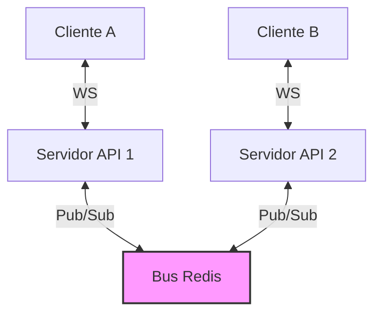

# MEJ-005: Escalamiento Horizontal en Canales de WebSockets

Este documento describe la propuesta técnica para habilitar la capacidad de escalamiento horizontal (clustering) en la arquitectura de WebSockets del proyecto.

## Escalamiento Horizontal mediante Bus de Mensajes (Redis Pub/Sub)

### Problema Identificado
Las conexiones y salas de WebSockets se gestionan en la memoria RAM del servidor Express local mediante un objeto `Map`. Si se escala horizontalmente (múltiples instancias del contenedor backend detrás de un balanceador de carga), un mensaje publicado en la instancia "A" no se transmitirá a los usuarios conectados a la instancia "B", rompiendo la sincronización en tiempo real.

Es decir, todo lo que ocurra en el chat o en las notificaciones, no llegará a todos los usuarios porque esta en la memoria de un servidor en concreto, y si existen varios servidores corriendo, no se podrá comunicar entre si, rompiendo la sincronización en tiempo real. Por lo tanto, no se puede aplicar escalamiento horizontal.

### Solución Propuesta
Desacoplar la gestión de distribución de eventos utilizando un bus de mensajes basado en **Redis Pub/Sub**.

#### Arquitectura de Distribución


#### Flujo Técnico:
1. Cuando un usuario envía un mensaje a través de HTTP (`POST /api/chat`), el servidor Express que recibe la petición guarda el registro en la base de datos de MySQL.
2. En lugar de hacer un broadcast únicamente local, el servidor Express publica el evento de chat en un canal global de Redis:
   ```javascript
   redisPublisher.publish('ws-events', JSON.stringify({ event: 'chat:new', data: msg }));
   ```
3. Todas las instancias del backend se suscriben al canal `'ws-events'` de Redis al inicializarse.
4. Al recibir la notificación desde Redis, cada servidor busca en su `Map` interno si tiene clientes conectados que pertenezcan a la sala del mensaje (`requisito_id` o `nc_id`) y les despacha el mensaje a través de su conexión local de WebSocket.

## Porque Redis?

Redis es un sistema de **código abierto** que funciona como base de datos **en memoria**, pero también es usado ampliamente como **caché distribuido**, **broker de mensajes** y **gestor de sesiones**. Su característica principal es la **velocidad**, ya que almacena los datos directamente en la memoria RAM (aunque también puede persistirlos en disco si se configura), lo que permite realizar operaciones de lectura y escritura en microsegundos.

Es decir, permite mayor velocidad, persistir los datos para evitar tener que procesar las consultas a la base de datos cada vez que se necesita un dato (lo que aumenta la velocidad de la aplicación), permite escalabilidad horizontal (lo que significa que se puede escalar horizontalmente la aplicación sin romper la sincronización en tiempo real) y ademas permite implementar patrones de diseño como el de pub/sub, lo que lo convierte en una herramienta muy versátil para el desarrollo de aplicaciones web.
